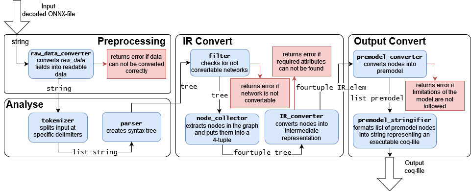

# A verified converter for neural networks from ONNX to coq

Code for the paper "A Formally Verified Neural Network Converter for the Interactive Theorem Prover Coq".

For the formal verification of neural networks, a trained neural network is typically converted into a representation that a theorem prover can process. Since the verification results apply only to the converted network, the conversion is critical and must be trustworthy. This paper introduces the first formally verified neural network converter for a theorem prover, specifically the interactive theorem prover Coq. The verified converter contributes a reliable verification of neural networks within Coq by narrowing the gap between the execution and the verification environment of neural networks.

Link: [https://link.springer.com/chapter/10.1007/978-3-031-98208-8_12](https://link.springer.com/chapter/10.1007/978-3-031-98208-8_12)

## Requirements

* The Coq Proof Assistant, version 8.14.1, compiled with OCaml 4.12.1
* Coq.io 4.0.0
* Coquelicot Version 3.2.0 

(Coquelicot is only for executing the output, not necessary for the converter. If not installed, errors are thrown during compilation, which can be ignored)

## Build

To compile, run `compile.sh`. You can also manually compile all files with `coqc`.

## Run

After a successful compilement, you may run `./converter.native input_file output_file`, where `input_file` must be a decoded ONNX-file. An ONNX file can be
decoded using a script similar to `decode_cartpole.sh` in the folder `example_net`.

## Flowchart

## Limits

Currently, the converter can convert nets with the size of 4100 parameters. An example for such a network is uploaded in this repository: `example_net/convertable.onnx`. However, the converter runs into memory issues when converting networks as large as 4500 parameters. An example of such a network is uploaded in this repository: `example_net/unconvertable.onnx`. We are currently working on solutions to circumvent this restriction.
