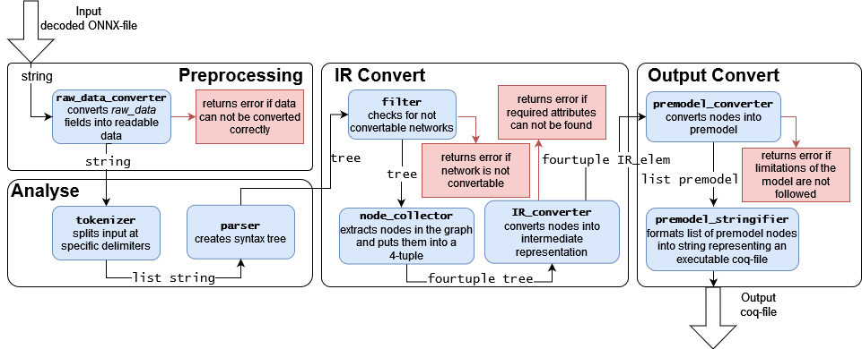

# A verified converter for neural networks from ONNX to coq

## Requirements

* The Coq Proof Assistant, version 8.14.1, compiled with OCaml 4.12.1
* Coq.io 4.0.0
* Coquelicot Version 3.2.0 

(Coquelicot is only for executing the output, not necessary for the converter. If not installed, errors are thrown during compilation, which can be ignored)

## Build

To compile, run `compile.sh`. You can also manually compile all files with `coqc`.

## Run

After a successful compilement, you may run `./converter.native input_file output_file`, where `input_file` must be a decoded ONNX-file.

## Flowchart

